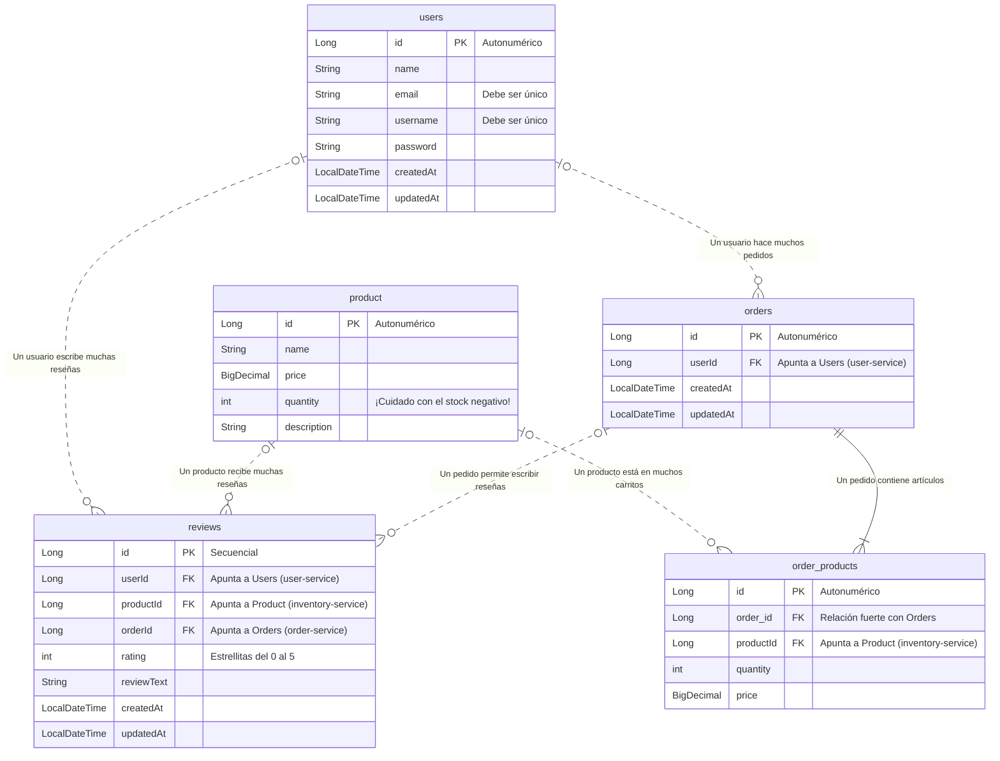

# 🗺️ Mapa de la Base de Datos (Microservicios Textiles)

¡Hola equipo! 👋 He preparado este diagrama para que todos tengamos súper claro cómo está armada nuestra base de datos en los servidores de producción (`sistematextil.pp.ua`). 

Como estamos usando una arquitectura moderna basada en microservicios, nuestras tablas no están todas amontonadas en una sola base de datos gigante. Cada servicio tiene su propia parcela de información. Para que el diagrama sea fácil de leer, he usado **líneas sólidas** para mostrar las relaciones tradicionales (dentro de una misma base de datos) y **líneas punteadas** para mostrar cómo viajan los IDs a través de internet de un microservicio a otro.

¡Espero que esta radiografía de nuestro backend les sea muy útil! 🚀

---

### 🔍 3 Datos curiosos de nuestra arquitectura actual:

1. **Totalmente Independientes:** Fíjate que `User`, `Product` y `Review` viven en universos totalmente separados. Si el servicio de inventario se cae, los usuarios pueden seguir iniciando sesión tranquilamente.
2. **Magia en las Órdenes:** En el `order-service`, la compra y sus artículos (`order_products`) se guardan al mismísimo tiempo. Si algo falla a la mitad, PostgreSQL deshace todo gracias al `@OneToMany(cascade = CascadeType.ALL)`. ¡Adiós datos corruptos!
3. **El Misterio del Estado:** Como puedes ver en la cajita de `orders`, actualmente no guardamos si un paquete ya fue enviado o entregado (solo guardamos la fecha de creación y actualización). Si en el futuro queremos rastrear paquetes, ¡aquí es donde tendremos que agregar una nueva columna! 📦
